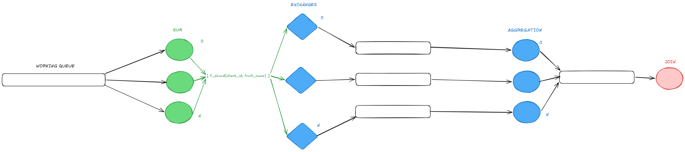

# Trabajo Práctico - Coordinación

En este trabajo se busca familiarizar a los estudiantes con los desafíos de la coordinación del trabajo y el control de la complejidad en sistemas distribuidos. Para tal fin se provee un esqueleto de un sistema de control de stock de una verdulería y un conjunto de escenarios de creciente grado de complejidad y distribución que demandarán mayor sofisticación en la comunicación de las partes involucradas.

## Ejecución

`make up` : Inicia los contenedores del sistema y comienza a seguir los logs de todos ellos en un solo flujo de salida.

`make down`:   Detiene los contenedores y libera los recursos asociados.

`make logs`: Sigue los logs de todos los contenedores en un solo flujo de salida.

`make test`: Inicia los contenedores del sistema, espera a que los clientes finalicen, compara los resultados con una ejecución serial y detiene los contenederes.

`make switch`: Permite alternar rápidamente entre los archivos de docker compose de los distintos escenarios provistos.

## Elementos del sistema objetivo

*Fig. 1: Diagrama de Robustez*

### Client

Lee un archivo de entrada y envía por TCP/IP pares (fruta, cantidad) al sistema.
Cuando finaliza el envío de datos, aguarda un top de pares (fruta, cantidad) y vuelca el resultado en un archivo de salida csv.
El criterio y tamaño del top dependen de la configuración del sistema. Por defecto se trata de un top 3 de frutas de acuerdo a la cantidad total almacenada.

### Gateway

Es el punto de entrada y salida del sistema. Intercambia mensajes con los clientes y las colas internas utilizando distintos protocolos.

### Sum
 
Recibe pares  (fruta, cantidad) y aplica la función Suma de la clase `FruitItem`. Por defecto esa suma es la canónica para los números enteros, ej:

`("manzana", 5) + ("manzana", 8) = ("manzana", 13)`

Pero su implementación podría modificarse.
Cuando se detecta el final de la ingesta de datos envía los pares (fruta, cantidad) totales a los Aggregators.

### Aggregator

Consolida los datos de las distintas instancias de Sum.
Cuando se detecta el final de la ingesta, se calcula un top parcial y se envía esa información al Joiner.

### Joiner

Recibe tops parciales de las instancias del Aggregator.
Cuando se detecta el final de la ingesta, se envía el top final hacia el gateway para ser entregado al cliente.

## Limitaciones del esqueleto provisto

La implementación base respeta la división de responsabilidades de los distintos controles y hace uso de la clase `FruitItem` como un elemento opaco, sin asumir la implementación de las funciones de Suma y Comparación.

No obstante, esta implementación no cubre los objetivos buscados tal y como es presentada. Entre sus falencias puede destactarse que:

 - No se implementa la interfaz del middleware. 
 - No se dividen los flujos de datos de los clientes más allá del Gateway, por lo que no se es capaz de resolver múltiples consultas concurrentemente.
 - No se implementan mecanismos de sincronización que permitan escalar los controles Sum y Aggregator. En particular:
   - Las instancias de Sum se dividen el trabajo, pero solo una de ellas recibe la notificación de finalización en la ingesta de datos.
   - Las instancias de Sum realizan _broadcast_ a todas las instancias de Aggregator, en lugar de agrupar los datos por algún criterio y evitar procesamiento redundante.
  - No se maneja la señal SIGTERM, con la salvedad de los clientes y el Gateway.

## Condiciones de Entrega

El código de este repositorio se agrupa en dos carpetas, una para Python y otra para Golang. Los estudiantes deberán elegir **sólo uno** de estos lenguajes y realizar una implementación que funcione correctamente ante cambios en la multiplicidad de los controles (archivo de docker compose), los archivos de entrada y las implementaciones de las funciones de Suma y Comparación del `FruitItem`.

*Fig. 2: Elementos mutables e inmutables*

A modo de referencia, en la *Figura 2* se marcan en tonos oscuros los elementos que los estudiantes no deben alterar y en tonos claros aquellos sobre los que tienen libertad de decisión.
Al momento de la evaluación y ejecución de las pruebas se **descartarán** o **reemplazarán** :

- Los archivos de entrada de la carpeta `datasets`.
- El archivo docker compose principal y los de la carpeta `scenarios`.
- Todos los archivos Dockerfile.
- Todo el código del cliente.
- Todo el código del gateway, salvo `message_handler`.
- La implementación del protocolo de comunicación externo y `FruitItem`.

Redactar un breve informe explicando el modo en que se coordinan las instancias de Sum y Aggregation, así como el modo en el que el sistema escala respecto a los clientes y a la cantidad de controles.

# Detalles de la implementación

Voy a ir explicando escenario por escenario que propuse como solución y qué opciones considere más alla de la implementada:

- Escenario 2 - Múltiples clientes:
  
En este caso era bastante sencillo lo único que debía hacer era a nivel sums manejar con una estructura de datos con una dimensión más, que me permita almacenar no solo las frutas si no que guardar las frutas por cliente. No tiene mucha ciencia este caso no hay mucho más que agregar.

- Escenario 3 - Múltiples sums:

Este sin duda es el escenario que más me costó destrabar. En principio hablemos de qué necesitamos hacer para pasar a la instancia de agregación para entender cuál es el problema y luego ver cuáles fueron las opciones que se me ocurrieron.

En sí es necesario coordinar el final de la lectura del archivo porque para la etapa de agregación necesitamos todos los datos juntos de un cliente, porque si no estaríamos perdiendo información. Por ello es necesario en sí que el EOF llegue por cliente; pero además, cada sum debe notificar cuando termino de procesar todos los datos de ese cliente, porque si no podria pasar que si bien le llega el EOF al sum_1, el sum_2 sigue procesando información (sumandola), entonces si en aggregation lo que hiciera sería solo chequear que me llego **un** EOF, estaría también potencialmente perdiendo información.

Para solucionarlo, pensé a gran escala dos opciones: 

1. Límitar el canal de rabbit para que solo puedan tener buffereados entre todas las intancias de sum un único mensaje. Esta opción es pésima: el tp en sí es sumar y hacer un top k de algo, algo que podríamos hacer recien salidos de Algoritmos 2 con tres .go a lo sumo. Por ello, si estamos buscando crear un sistema distribuido que realice esta operación minimamente tiene que aprovechar el paralelismo que nos otorga las múltiples instancias de Sum, porque si no estaríamos tirando toda nuestra performance al tacho.

2. Coordinar! Lo dice bien el tp y se ve en Concurrentes distintos algoritmos para coordinar mensajes y que todas las instancias estén enterados de lo que pasa  (== que estén coordinados). Para dicha coordinación lo que necesito saber es si los distintos sums han terminado de procesar todos los mensajes del cliente X: esto me hizo un poco de ruido de como saber dicha información por lo cual opté por una opción quizás no tan elegante pero no vi otra alternativa, y es que el protocolo del gateway lleve la cuenta de cuantos mensajes va despachando de cada cliente, por lo cual al momento de coordinar lo que debo fijarme es que la sumatoria de los sums sea igual al count que hizo el gateway. Hay tres opciones en este caso:

- Que el mensaje llegue al líder y SUMA(mensajes_suma_i) for i in range(sumsAmount) == COUNT(mensajes_gateway). En este caso simplemente tengo que avisarle al resto de nodos sum que despachen el estado del cliente X.
- Que el mensaje llegue al líder y la suma no de. En este caso, al asumir que no hay caídas, simplemente lo que pasó es que alguno o varios de los sums no termino de consumir todos los mensajes del buffer interno de Rabbit del cliente X. En este caso simplemente vuelvo a iniciar el anillo y confio en que eventualemente la comparación va a dar. Acá podría haber agregado un conteo de cuantas veces hice la vuelta en el anillo para que no quede loopeando infinitamente pero al asumir no caídas es un caso imposible por lo cual no vi la necesidad de agregarlo, aunque no estaría de más.
- Que el mensaje no llegue al líder. En este caso simplemente debo sumar los mensajes que yo vi del cliente X al conteo actual que está en el mensaje que viaja a través de Rabbit.

La primera opción que se me ocurrió es que un líder (el que recibió el EOF directo de la working queue) broadcastee a todo el resto de sums a traves de Rabbit que le ha llegado el EOF, y luego cada uno responda individualmente al líder. Esto tenía un costo alto porque deberia crear una queue por cada par de sums posibles, pero tenía la ventaja de que en promedio el tiempo de respuesta iba a ser más alto, limitado por el procesamiento del líder cuando recibe todos los mensajes juntos.

La segunda opción que fue la que implementé es hacer un anillo y entonces voy a tener N-1 colas en total, pero en contra parte tengo que esperar a que el mensaje "de toda la vuelta".

- Escenario 4 - Múltiples aggregations:

Otro escenario que me dio un poco de dolor de cabeza, pero que con lo que fuimos hablando en clase me termino de cerrar porque hay que hacer lo que había que hacer. Partamos de la base: si yo por cliente mandara mensajes indiscriminadamente a cualquier Aggregation, me podría pasar que mi top local no sea óptimo, por lo cual tampoco va ser óptimo mi top global, es una cuestión meramente algorítmica que ilustro con un ejemplo sencillo.

Si yo estoy calculando un top K con K=2, podría tener en cada Aggregation un top algo así:

Aggregation 1:

1. A, 100
2. B, 99
3. C, 88

Aggregation 2:

1. D, 50
2. E, 50
3. C, 88

Aggregation 3:

1. F, 25
2. G, 75
3. C, 88

Acá al cortarlo en 2 basicamente nunca vería el C, que si calculo un top K "global" o centralizado, claramente sería el top 1.

Entonces la solución es que por cada tupla (cliente, fruta) lo calcule un único aggregation en particular. En otras palabras, hay que shardear por la key (cliente, fruta). Para ello use hash/fnv de la standard library de Golang y calcule el hash del string concatenado cliente+nombre_fruta. Simplemente con esto me aseguro que el top global va ser el óptimo. Para ello también use patrón productor-consumidor donde los productores podrían ser varios (cualquiera de las instancias de Sum) y el consumidor va ser cada instancia de Aggregation en particular (cada nodo tiene su propia queue).

Finalmente en el join para este escenario debia contar los EOF por cada uno de los aggregations y en el momento que reciba el EOF de uno y cada uno de los Aggregation entonces ahi podia recalcular el top uniendo los resultados locales de cada Aggregation, y quedarme con el top global. Luego despacho el mensaje a Rabbit para que lo reciba el gateway y se lo comunique al cliente.

Dejo un diagrama de la arquitectura final del sum en adelante (obviando la queue que se recomunica con el gateway nuevamente).

## Comentarios

Lo más groso que me quedo fuera de scope es el hecho de los mensajes repetidos. En el join por ejemplo lo handlee porque necesitaba si o si que los aggregations uno y cada uno me envie su EOF por cliente; si no tuviera esto en cuenta el AGG_1 me podría sumar dos veces un EOF y capaz el AGG_3 todavia no lo habia enviado, por lo cual quizas todavía tampoco habia enviado su top. Se que esto debería estar en todos los distintos tipos de nodos pero desconozco como hacerlo por ejemplo en la working queue de los sums; si el mensaje me llega a la misma instancia de Sum es trivial, simplemente le tendria que agregar un ID al msg antes de ser despachado desde el gateway y antes de procesar me fijo si ya lo habia procesado o no, pero si el mensaje duplicado me cae en una instancia distinta de Sum, estoy obligado a coordinar esos mensajes también, para poder descartarlo si alguno de los sums lo procesó ya.

También a último momento borré el uso de UUID que venia usando para identificar a los clientes desde el gateway solo porque relei la aclaración del readme de que archivos se van a reemplazar, y aunque imagino que fue algo que se escapó no mas, al no poder hacer copy del go.sum del client (cosa que en todo el resto de Dockerfiles sí está hecho) no puedo poner una library nueva que no sea estandar. Use la variable global (horrible) en el messagehandler porque sin poder copiar el go.sum y sin poder agregar más codigo en la folder gateway no tengo otra alternativa.
